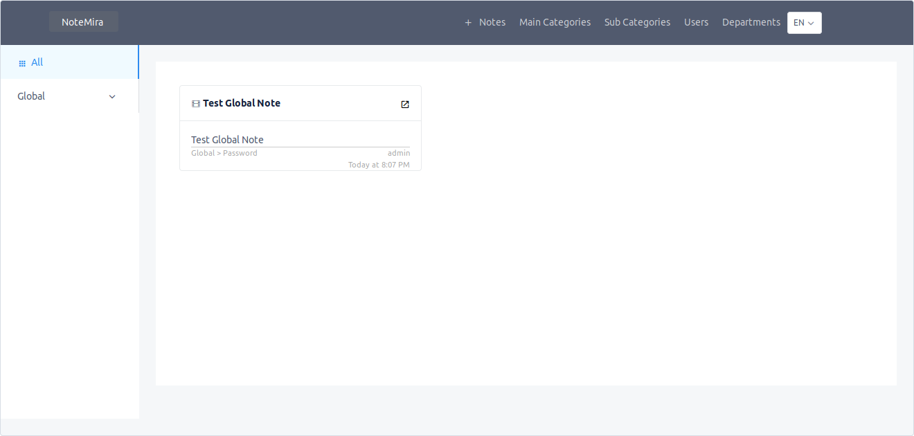
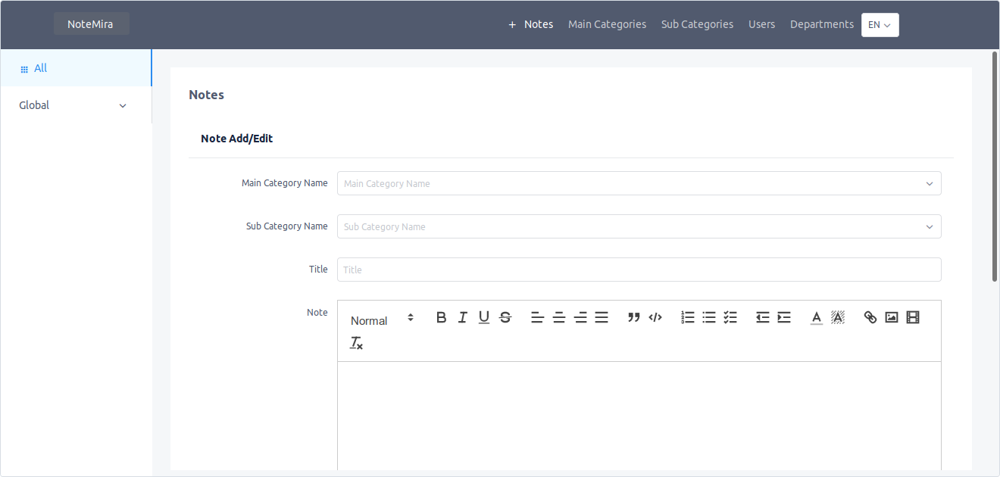

# NoteMira

Easy note manager. For use personal or firms. Multi-lang.

Kullanışlı, basit bir not alma aracı. Aynı zamanda; şirket içi not alma işlemine uygun özel not, departman bazlı özel not içermektedir. Çoklu dil desteklemektedir.

## Installation

```
git clone https://kod.acikkaynak.gov.tr/myazarc/notemira NoteMira
//or
git clone https://github.com/myazarc/NoteMira NoteMira

cd NoteMira
```

**Database**

Load sql.sql file

Default mysql,

With knex dialect: PostgreSQL,Amazon Redshift,MySQL,MariaDB,SQLite3,MSSQL,Oracle

**Server**

```
cd server
yarn //or npm install
```

Edit File(Database,cors,secret code, defaults port): server/src/config/index.js

**Dev Server**

Server URL(Default): http://127.0.0.1:8081/api/

```
yarn dev // or npm run dev
```

**Client**

```
cd client
yarn //or npm install
```

Edit File(api url): server/src/api/index.js

**Dev Client**

Client URL(Default): http://127.0.0.1:8080/

```
yarn serve // or npm run serve
```

## Production

**Server**

```
cd client
yarn //or npm install
yarn build //or npm run build
```

**Client**

```
cd server
yarn //or npm install
node .
```

Then App Url(With express): http://127.0.0.1:8081/

## Screenshots




## LICENSE

MIT License

Copyright (c) 2019 Mustafa <myazarc@gmail.com>

Permission is hereby granted, free of charge, to any person obtaining a copy
of this software and associated documentation files (the "Software"), to deal
in the Software without restriction, including without limitation the rights
to use, copy, modify, merge, publish, distribute, sublicense, and/or sell
copies of the Software, and to permit persons to whom the Software is
furnished to do so, subject to the following conditions:

The above copyright notice and this permission notice shall be included in all
copies or substantial portions of the Software.

THE SOFTWARE IS PROVIDED "AS IS", WITHOUT WARRANTY OF ANY KIND, EXPRESS OR
IMPLIED, INCLUDING BUT NOT LIMITED TO THE WARRANTIES OF MERCHANTABILITY,
FITNESS FOR A PARTICULAR PURPOSE AND NONINFRINGEMENT. IN NO EVENT SHALL THE
AUTHORS OR COPYRIGHT HOLDERS BE LIABLE FOR ANY CLAIM, DAMAGES OR OTHER
LIABILITY, WHETHER IN AN ACTION OF CONTRACT, TORT OR OTHERWISE, ARISING FROM,
OUT OF OR IN CONNECTION WITH THE SOFTWARE OR THE USE OR OTHER DEALINGS IN THE
SOFTWARE.
